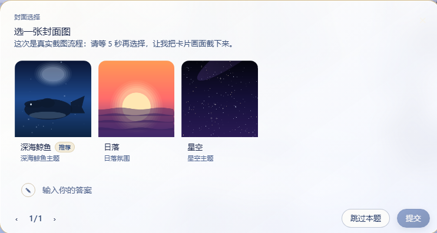
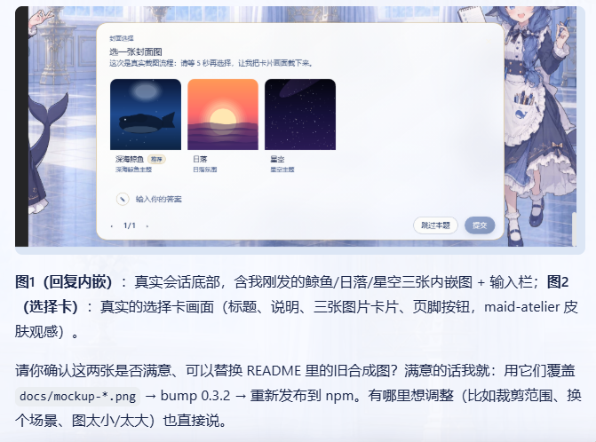

# dsh-plugin-image-tools


[**中文**](./README.md) | [English](./README.en.md)

**dsh 插件市场里唯一支持「图片选择卡」的插件**：给 DeepSeek Harness Web GUI 增加图片能力，
三个工具覆盖三种场景——模型让你在选项里挑图、在回复正文里展示图、你把图发给盲模型。全部零 token 本地渲染：

| 工具 | 场景 | 效果 |
|---|---|---|
| `ask_user_choice` | 模型让用户在**选项**里挑图 | Web GUI 渲染图片选择卡，可放大查看，答案协议与原生一致 |
| `show_images` | 模型在**回复正文**里展示图片 | 图片与文字混排显示在聊天里，点击可放大 |
| `save_received_images` | 用户**发图给盲模型**（无视觉输入的适配器） | 图片以文件形式保存到工作区，模型可下载/分析 |

图片来源统一支持三种：**本地路径**（相对会话工作区或绝对路径，含 ComfyUI 出图产物）、
**http(s) URL**（服务端拉取后转存）、**base64 data URI**。纯插件实现，不改核心包。

## 效果图

### 图片选择卡（ask_user_choice）



模型问「选一张封面」，每个选项带一张图，用户点卡片（或放大镜）即可选择。

### 回复内嵌图片（show_images）



模型在回复里调用 `show_images`，把返回的 markdown 片段粘贴进正文，图片就随文字一起显示。

> 两张效果图均为真实 Web GUI 截图（maid-atelier 皮肤）。

## 功能

- **`ask_user_choice`**（图片 / 图文混合选项）：
  - 每个选项可带一张图片（`path` / `url` / `data`），纯图片、纯文字、图片+文字可同题混排；
  - 支持多题分页、单选/多选、自定义答案、跳过、推荐标注
    （label 末尾 `(Recommended)` / `(推荐)`）；
  - 点击缩略图（或放大镜按钮）弹出 Lightbox 大图，Esc / 点遮罩 / 关闭按钮退出。
- **`show_images`**（回复内嵌图片）：
  - 一次展示 1~9 张图，每张可带 `caption` 说明；
  - 工具返回绝对 URL 的 markdown 图片片段，模型原样粘贴进回复正文即随文显示；
  - 客户端插件自动增强这类图片：圆角样式、悬停显示说明、点击放大查看、加载失败降级。
- **`save_received_images`**（盲模型收图 → 文件）：
  - 用户往聊天里发图片时，`agent/pre-step` 监听器把消息里的 image 内容块重写为
    文本占位符（`dshimg:<attachmentId>`）——文本-only 适配器（如 DeepSeek）不再
    因图片块报 `UNSUPPORTED_CONTENT`，回合照常运行；
  - 用户气泡里由客户端增强器把占位符替换为可放大的图片回显（附件经
    `/dsh-plugin-image-tools/attachment/<id>` 路由出字节）；
  - 模型看到占位符后调用 `save_received_images`，把图片按 attachmentId 保存为
    工作区文件（默认 `received/`），之后可用文件/命令工具分析（尺寸、像素、哈希等）；
  - 保存的文件名优先用附件自带的安全文件名，否则按 `image-<n>-<时间戳>.<ext>` 生成。
- 纯文字问题不带图片时，客户端自动放行给原生 UI，互不影响。

## 目录结构

```
lib/index.js          服务端：三个工具注册 + pre-step 重写 + 图片/附件注册表 + web 路由（零运行时依赖）
lib/client.js         客户端：composer 链条目 + 图片选择 UI + 内嵌/收图图片增强（浏览器模块加载器格式，免构建）
scripts/selfcheck.mjs     纯函数自检（node scripts/selfcheck.mjs）
scripts/smoke-server.mjs  服务端集成冒烟（假 ctx 跑通工具→路由→pre-step 重写→落盘全链路）
scripts/smoke-client.mjs  客户端冒烟（真实 react 渲染选择卡 + 增强纯函数）
cordis.patch.yml      bundle 补丁（挂载行）
docs/                 效果图（README 展示用）
```

## 配置

无需任何配置，安装即用：

- 不读取环境变量，不需要 API Key / token，不写配置文件；
- 图片来源三种形态（本地路径 / http(s) URL / base64 data URI）直接可用，无白名单配置；
- 图片内联预览走同源字节路由（loopback），无外部服务依赖；
- 包自带 `cordis.patch.yml` 挂载行，经 `dsh.profile.bundles` 自动应用，无需手动改配置。

## 安装

```powershell
# npm（推荐）
dsh plugin --profile web add dsh-plugin-image-tools
# 或 GitHub
dsh plugin --profile web add github:Pasumao/dsh-plugin-image-tools
```

源码安装（本地开发 / 调试）：

```bash
git clone https://github.com/Pasumao/dsh-plugin-image-tools.git
cd dsh-plugin-image-tools
npm install
# 以 link: 方式挂载进 profile
```

装完重启 dsh（launcher），然后刷新浏览器页面。包自带 `cordis.patch.yml` 挂载行，
经 `dsh.profile.bundles` 自动应用（与 dsh-notify 同机制），无需手动改配置。

## 模型用法示例

### ask_user_choice：看图挑选项

```jsonc
{
  "questions": [
    {
      "id": "cover",
      "question": "选一张封面图",
      "header": "封面选择",
      "options": [
        { "label": "深海鲸鱼 (Recommended)", "image": { "path": "novel/assets/covers/whale.png" } },
        { "label": "星空",
          "image": { "url": "https://example.com/stars.png" } },
        { "label": "手绘风",
          "image": { "data": "data:image/png;base64,iVBORw0KGgo..." } },
        { "label": "都不选，我自己说", "description": "选这个可以在下方输入自定义答案" }
      ],
      "multi_select": false
    }
  ]
}
// 返回：{ "answers": [ { "id": "cover", "selected": ["深海鲸鱼 (Recommended)"] } ] }
```

### show_images：回复里展示图片

```jsonc
// 调用 show_images
{
  "images": [
    { "image": { "path": "novel/assets/covers/whale.png" }, "caption": "深海鲸鱼封面" },
    { "image": { "url": "https://example.com/stars.png" }, "caption": "星空" }
  ]
}
// 返回：{ "markdown": ["", ""], "note": "..." }
```

模型把 `markdown` 数组里的片段**原样**逐行粘贴进回复正文，图片随文字显示：

```markdown
这是为你生成的封面候选：


需要调整配色或构图可以告诉我。
```

## 实现要点（为什么是插件而不是改核心）

浏览器端消费 `question/requested` 帧时用 zod schema 严格解析，选项对象上的未知
字段会被剥离；助手消息 content 由模型文本生成，也没有携带结构化图片块的通道。
所以图片**不能**塞进 option / content 字段。本插件改为：

1. 服务端把图片字节归一化进内存注册表，通过自定义 web 路由
   `/dsh-plugin-image-tools/<pickId>/<index>`（选择卡）、
   `/dsh-plugin-image-tools/show/<showId>/<index>`（回复内嵌）与
   `/dsh-plugin-image-tools/attachment/<attachmentId>`（盲模型收图回显）
   直接提供字节（同源 `` 加载）；
2. 选择卡：在问题的 `detail`（标准字符串字段，原样透传）开头写入不可见的
   HTML 注释标记 `<!--dsh-pick:v1:<base64url JSON>-->`，携带 pickId 与带图选项下标；
   客户端插件在 `conversation.composer` slot 链注册条目（priority 更小，优先于原生），
   识别标记后渲染图片选择卡；无标记的问题交给原生 UI；
3. 回复内嵌：`show_images` 返回绝对 URL（宿主 origin 由 `ctx.webServer.host/port`
   推导），模型粘贴进正文，核心 markdown 渲染器原生显示；客户端再对
   `/dsh-plugin-image-tools/show/` 前缀的图片做渐进增强（MutationObserver 发现 +
   单节点样式/事件注入，纯 DOM，不侵入 React 渲染树）；
4. 盲模型收图：注册 `agent/pre-step` waterfall 监听器（与 agent-instructions /
   time-context 同机制），把进入 LLM 步骤的消息批次里的 image 块重写为文本占位符
   （登记附件 ref 到 TTL 注册表），会话日志/UI 因此保持纯文本安全；客户端增强器
   在用户气泡文本里识别 `dshimg:<id>` 占位符并替换为可放大图片；`save_received_images`
   经 `ctx.attachments.readImage` 取回附件字节落盘。

详见 `设计说明.md`。

## 安全与限制

- 图片字节仅存于进程内存：选择卡图片随问题回答/取消立即释放；
  内嵌图片与附件回显依赖 30 分钟 TTL 清理（需存活到回复渲染完成）。
- **浏览器缓存兜底**：图片路由的 URL 是内容寻址的（pickId/showId 为 UUID、
  attachmentId 为内容哈希），字节永不改变，因此响应头下发
  `Cache-Control: private, max-age=2592000, immutable`（30 天）。图片一旦在
  浏览器里加载成功，字节就留在浏览器本地缓存——之后源文件被删除/覆盖、
  服务端 TTL 清理、甚至 dsh 重启，刷新页面 / 回看历史消息时浏览器直接命中
  本地缓存，图片依然可见（不再向服务端发请求）。
- 单张图片上限 20 MiB；仅支持 PNG / JPEG / WebP / GIF（按魔数校验，声明不符会报错）。
- 图片路由为同源普通 HTTP 路由（与 GUI 同信任级别），未加额外鉴权。
- 内嵌图片的 markdown URL 是绝对地址（`http://host:port`，由服务端监听配置推导）；
  若 GUI 经过反向代理/换端口访问，历史消息里的图片地址可能失效（同选择卡的限制）。

## 相关插件

本插件属于 **Pasumao 的 dsh 插件生态**，同系列已发布插件可搭配使用：

| 插件（npm） | GitHub | 说明 |
|---|---|---|
| [dsh-notify](https://www.npmjs.com/package/dsh-notify) | [GitHub 仓库](https://github.com/Pasumao/dsh-plugin-notify) | Windows 原生通知 + 系统托盘 |
| [dsh-plugin-choice-refresh](https://www.npmjs.com/package/dsh-plugin-choice-refresh) | [GitHub 仓库](https://github.com/Pasumao/dsh-plugin-choice-refresh) | 选择增强：重新生成选项 / 更多选项 |
| [dsh-plugin-dev-kb](https://www.npmjs.com/package/dsh-plugin-dev-kb) | [GitHub 仓库](https://github.com/Pasumao/dsh-plugin-dev-kb) | 插件开发知识库（官方文档完整镜像 + 技能） |
| [dsh-plugin-table-zoom](https://www.npmjs.com/package/dsh-plugin-table-zoom) | [GitHub 仓库](https://github.com/Pasumao/dsh-plugin-table-zoom) | 聊天长表格浮窗查看 + 一键复制 Markdown |
| [dsh-plugin-windows-guard](https://www.npmjs.com/package/dsh-plugin-windows-guard) | [GitHub 仓库](https://github.com/Pasumao/dsh-plugin-windows-guard) | Windows 环境防坑：守则技能 + 乱码检测 / 危险写拦截 / 编码诊断修复 |
| [dsh-plugin-workbench](https://www.npmjs.com/package/dsh-plugin-workbench) | [GitHub 仓库](https://github.com/Pasumao/dsh-plugin-workbench) | VS Code 风格文件浏览器 + 可编辑预览 |

> 本系列其余插件见 [Pasumao · dsh 插件](https://github.com/Pasumao)；觉得好用欢迎到 GitHub 点 ⭐。

## AI 生成声明

代码与文档由 AI 辅助生成（DeepSeek Harness），均经人工审查与实机验证
（`npm run smoke`：selfcheck + 假 ctx 服务端全链路 + 假客户端渲染）。

## 许可证

[MIT](./LICENSE)
